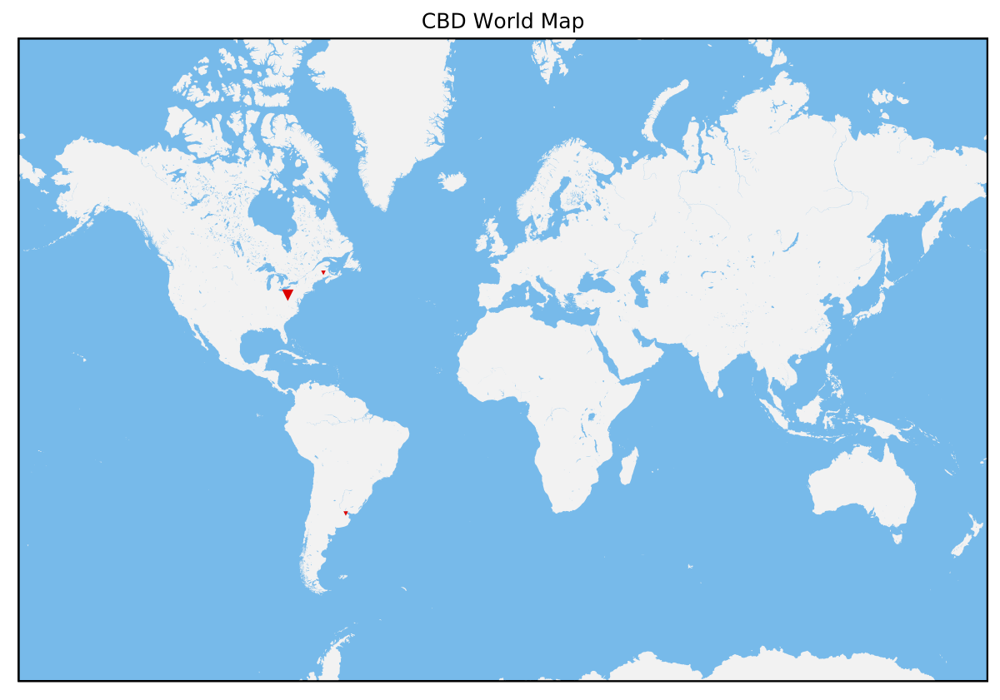

# cities2map
A function that converts an input file with data into a map.

## Input file
The input file should look like something like this. See file `staff.txt` for a full example.

```
Name,Position,City,Province,Country
Erin,Staff,Pittsburgh,Pennsylvania,United States
Samantha,Staff,Youngstown,Ohio,United States
Ivan,Staff,Buenos Aires,Buenos Aires,Argentina
```

## Example
To create the map



simply run 

```
python3 cities2map.py -f staff.txt -o map.eps -t "CBD World Map" -m 'v' -c 'red'
```

where

* `-m`/`--marker`
* `-t`/`--title`
* `-c`/`--color`
* `-f`/`--file`
* `-o`/`--output`

When you run the command above you should see output similar to the one below

[](https://asciinema.org/a/jG5ClXpBLLGKqSOqTkUeD3DUi)

## Disclaimer

This code has

* been tested on Python3 using conda
* Tested on Ubuntu 18.04
* I was not able to run this script on MacOSX Catalina

---
[](http://www.cbd.cmu.edu)

Copyleft © 2020 [icaoberg](http://www.andrew.cmu.edu/~icaoberg) at the [Computational Biology Department](http://www.cbd.cmu.edu) in [Carnegie Mellon University](http://www.cmu.edu)
